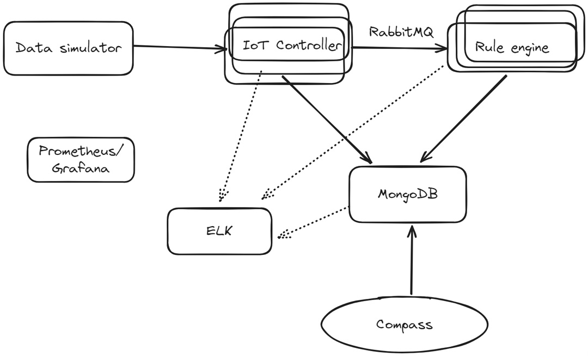

# Лабораторное задание. Разработка простого IoT сервиса

Цель: отработка принципов и подходов к разработке современных многоуровневых сервисов при решении практической задачи.

Задача: Разработать простое IoT решение и показать применение основных принципов разработки, которые обсуждались на лекции.

Примерная структура решения, которое необходимо разработать:

## Компоненты системы

1. IoT контроллер - сервис, который принимает входные пакеты с данными от «устройств», подключенных к системе. Принимаемые пакеты валидируются и сохраняются в базу данных MongoDB.
2. Rule engine - простой обработчик правил. Должен уметь обрабатывать мгновенные правила, т.е. основанные на конкретном пакете, и длящиеся, основанные на нескольких пакетах. Пакеты для обработки компонент получает от IoT контроллера через очередь сообщений.
   1. Мгновенное правило - Значение поля А от устройства 42 больше 5.
   2. Длящееся правило - Значение поля А от устройства 42 больше 5 на протяжении 10 пакетов от этого устройства.
3. Data simulator - Простой генератор данных для разрабатываемого IoT решения. Позволяет указать количество симулируемых устройств и частоту сообщений, которые генерируются каждым из них. Например, 100 устройств и 1 сообщение в секунду с устройства.

## Дополнительные компоненты

1. MongoDB - база данных, в которой хранятся IoT сообщения и отметки (например, алёрты) о срабатываниях правил, которые заложены в Rule Engine 
2. Compass - приложение для просмотра содержимого базы данных MongoDB, будет использоваться вместо пользовательского интерфейса приложения. 
3. RabbitMQ - очередь сообщений для обмена данными между IoT Контроллером и Rule Engine 
4. Postgres/Graphana - система для сбора и мониторинга метрик о работе приложения 
5. ELK Stack - система для сбора и просмотра логов разрабатываемого решения.
   
При выполнении работы можно использовать любой удобный язык программирования. Желательно выполнять работу на чистом Docker окружении, чтобы максимально разобраться в том, как работают компоненты на низком уровне.

## Содержание отчёта

1. Отчёт должен содержать полное описание архитектуры разрабатываемого приложения со всеми допущениями и дополнениями технического задания этой работы.
   
2. В отчёте необходимо рассмотреть применение дизайн принципов, рассмотренных на лекции, а также гипотетическую применимость. Т.е. если тот или иной принцип не может быть применён в силу простоты разрабатываемого решения, как он мог бы быть применён, если бы решение было бы больше или сложнее в том или ином отношении.

## Сроки и условия выполнения работы

1. Работа должна быть выполнена и продемонстрирована до даты аттестации по дисциплине (до зачёта\экзамена)
   
2. Работу можно выполнять в паре, но оба участника на защите проекта должны обладать полной информацией и отвечать на любые вопросы по работе
   
3. По мере готовности работы, необходимо подготовить короткую презентацию на 3-5 минут, в которой показать и рассказать о ключевых этапах и элементах проделанной работы.
